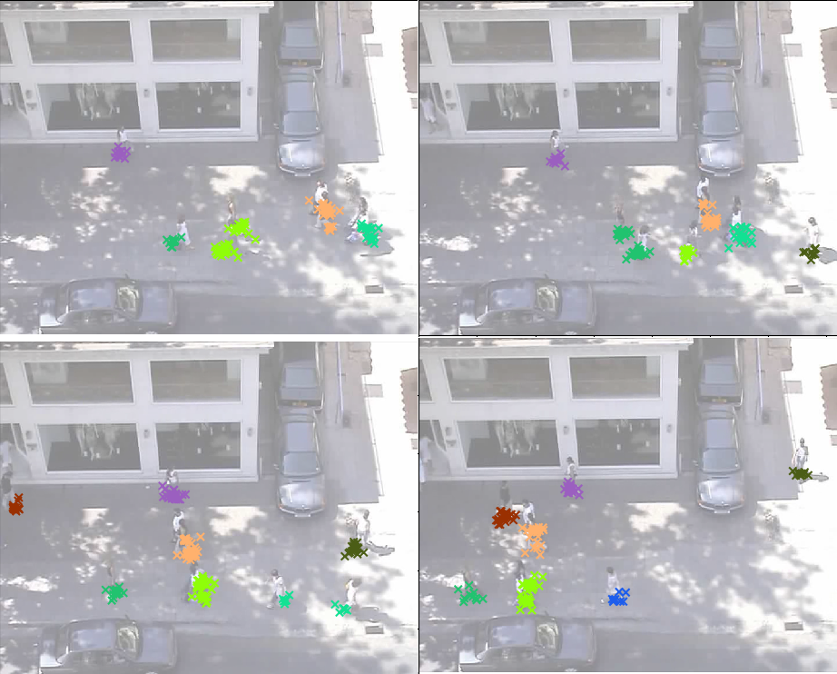

### Multi-target Tracking Using Dynamic mEans cluster
This repo is just a simplify python wrapper of dynmeans with CPP [dynamic-means(c++)](https://github.com/trevorcampbell/dynamic-means)

#### dependencies
- python 3.6
- json
- seaborn
- cv
- numpy
- matplotlib

- gcc/g++ 5.4
- swig
- also you should install liblpsolve to evaluate the perfomance. Of course, you can use Hungrian algorithm instead.
  if you want to directly used the evaluation codes, you can install liblpsolve by
  ```sh
  sudo apt-get install liblpsolve55-dev
    ```
    make sure liblpsolve55.so (not liblpsolve55.a) is located in your /usr/lib/ folder when the installation is 
    complete, and if it is not, move it to that location. If you compile against the static library (.a), 
    you will get linker errors about undefined references to dlclose, dlopen, colamd_*, etc.

#### dataset
We use the common trajectory prediction dataset: `ETH` and `UCY`. More details refer to `data/pre_process.py`.

#### Usage 
1. clone this reposity:
```sh
git clone https://github.com/ZongweiZhou1/Multitude.git
```

2. Navigate to the directory, make the dynmeans and evaluation codes.
```sh
   bash  ./make.sh
```

3. You can run the example with:
```sh
python basic_track.py --verbose 'trueLabels' --dataset 'zara01'
```
If `verbose=None` then it will not show the labels in fig, when `verbose=trueLables` it will show the groundtruth
. And when `verbose=learnedLabels` it will show the tracking results.

The `dataset` is which dataset you want to use.

#### results
without finetune:
learned Label


#### TODO:
-[x] how to generate simulated targets captured from cv.

-[x] how to get the matching relation.

-[x] how to use the results guide the tracking.

